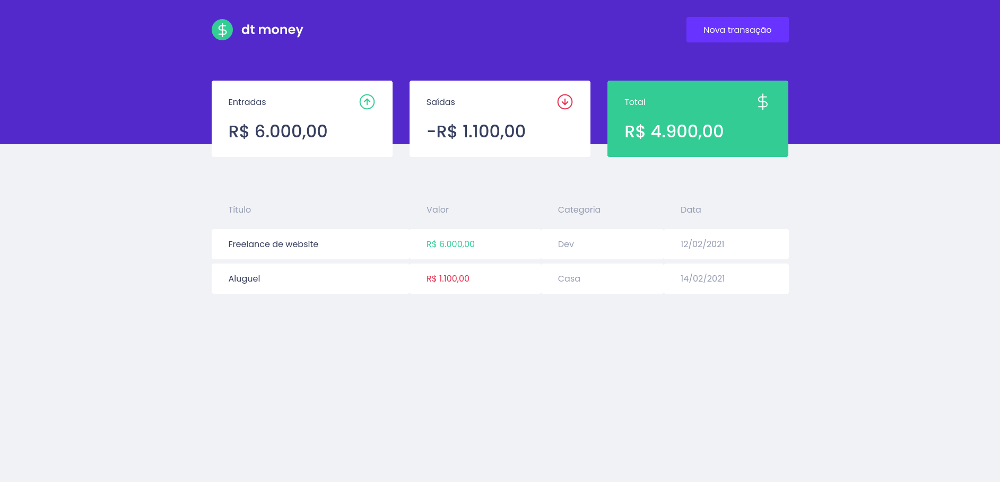

# Dt money
Aplicação desenvolvida através do ignite pela rocketseat. O objetivo é realizar o controle das transações, sendo elas: gastos ou ganhos.
Esta aplicação possui 3 funcionalidades básicas:
- Cadastrar a transação;
- Listar as transações cadastradas;
- Exibir as informações de entrada, saída e total;

### Tecnologias utilizadas

- React;
- React Hooks;
- react-modal;
- Context API;
- Typescript;
- styled-components;
- miragejs;
- polished;
- axios;
- yarn;

### Executando aplicação

##### Instalando dependências
```bash
  yarn
```

##### Start aplicação
```bash
  yarn dev
```

